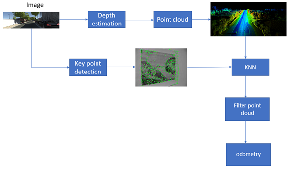

# 3D Point Cloud Generation from Single RGB Images

This repository implements a complete pipeline for generating high-quality 3D point clouds from single RGB images using state-of-the-art deep learning techniques. The system combines monocular depth estimation, keypoint detection, and advanced smoothing algorithms to produce accurate 3D reconstructions.

<div align="center">

</div>

### 🔥 Features
**Monocular Depth Estimation:** Uses LeReS (Learning to Recover 3D Scene Shape) with ResNeXt101 backbone
**Point Cloud Generation:** Converts depth maps to 3D point clouds using camera projection
**Advanced Smoothing:** Two smoothing options - RANSAC-based outlier removal or SuperPoint keypoint-guided KNN smoothing
**Visual Odometry:** Complete VO pipeline for trajectory estimation from image sequences
**Comprehensive Visualization:** Multiple depth map visualizations and 3D point cloud displays

## 🚀 Installation
### Prerequisites

<li> Python 3.7+ </li>
<li> CUDA-capable GPU (optional, for acceleration) </li>

### Install dependencies
```
pip install -r requirements.txt
```

### Download pretrained Weights

#### ResNeXt101 
```
wget https://pan.baidu.com/s/1o2oVMiLRu770Fdpa65Pdbw?pwd=g3yi
```

#### SuperPoint
```
wget https://github.com/SabihShah/Point-Cloud/blob/main/superpoint_v1.pth
```

## ⚡ Quick Start


### Inference:
#### Single Image Processing
```
python "main.py" --rgb_path 'path/to/rgb/image' --load_ckpt res101.pth 
```

#### With Keypoint-Based Smoothing
``` 
python main.py --rgb_path 'path/to/rgb/image' --load_ckpt res101.pth --smooth --use_keypoints --keypoint_weight superpoint_v1.pth --show_difference
```
*Remove the --use_keypoints and --keypoint_weight arguments to use **RANSAC** for outlier detection and removal*

#### Batch Processing with Visual Odometry
```
python "3d vo.py" --input path/to/directory/of/images --output_dir path/to/output/directory --load_ckpt weights/res101.pth --smooth --no_display --use_keypoints --keypoint_weight weights/superpoint_v1.pth --run_vo
```

*Other arguments can be set such as camera's intrinsic parameters if known for better results. Hyperparameters can be changed for experimentation inside the model definition*

### 🔬 Methodology
For detailed methodology, refer to [methodology](doc/methodology.pdf)


### 📖 Usage
#### Basic Usage
```
python main.py --input <IMAGE_PATH> --load_ckpt <CHECKPOINT_PATH> [OPTIONS]
```

#### Processing directory
```
python main.py --input <DIRECTORY_PATH> --output_dir <OUTPUT_DIR> --load_ckpt <CHECKPOINT_PATH> [OPTIONS]
```

### ⚙️ Arguments

**Required Arguments**

--input: Input RGB image file or directory
--load_ckpt: Path to LeReS checkpoint file

**Output Options**
```
--output_dir: Output directory for results
--no_display: Don't show visualizations
--file_extension: Image extension (default: jpg)
```
**Depth Model Options**
```
--backbone: Model backbone (default: resnext101)
--depth_scale: Scale factor for depth conversion (default: 1000.0)
```
**Camera Parameters**
```
--fx, --fy: Focal lengths (auto-estimated if not provided)
--cx, --cy: Principal point (auto-estimated if not provided)
```
**Point Cloud Options**
```
--skip: Pixel sampling rate (default: 1)
--smooth: Enable smoothing algorithms
--show_difference: Visualize before/after smoothing
```
**SuperPoint Options**
```
--use_keypoints: Use keypoint-based smoothing
--keypoint_weight: Path to SuperPoint weights
--conf_thresh: Detection confidence threshold (default: 0.015)
--nms_dist: Non-maximum suppression distance (default: 4)
--cuda: Use GPU acceleration
```
**Visual Odometry Options**
```
--run_vo: Run visual odometry on image sequence
--poses_file: Ground truth poses file (optional)
```

### 📝 Citation
If you use this code in your research, please consider citing:
```
@misc{point-cloud-mono,
  title={3D Point Cloud Generation from Single RGB Images},
  author={Your Name},
  year={2024},
  howpublished={\url{https://github.com/yourusername/Point-Cloud}}
}
```
